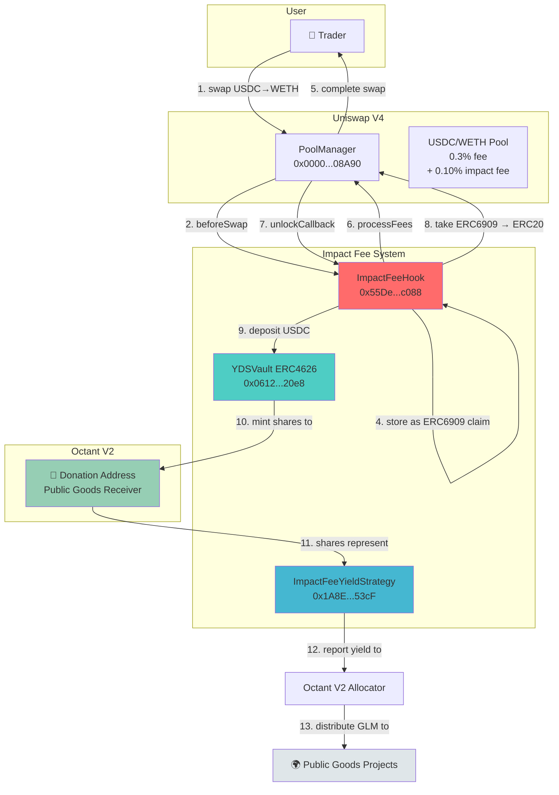

# Impact Fee Hook - Flow Diagram

## System Architecture



---

## Detailed Flow: Swap → Donation

### Phase 1: Fee Collection (On Swap)

```
┌─────────────────────────────────────────────────────────────┐
│ 1. Trader calls swap(USDC → WETH, 1000 USDC)               │
└─────────────────────────────────────────────────────────────┘
                           ↓
┌─────────────────────────────────────────────────────────────┐
│ 2. PoolManager.swap() triggers beforeSwap hook              │
│    → ImpactFeeHook.beforeSwap()                             │
└─────────────────────────────────────────────────────────────┘
                           ↓
┌─────────────────────────────────────────────────────────────┐
│ 3. Hook calculates fee:                                     │
│    feeAmount = 1000 * 10 / 10000 = 1 USDC (0.10%)          │
└─────────────────────────────────────────────────────────────┘
                           ↓
┌─────────────────────────────────────────────────────────────┐
│ 4. Hook takes fee via delta:                                │
│    amountSpecified = -1001 USDC (includes fee)              │
│    Returns: delta = 1 USDC, selector = beforeSwap           │
└─────────────────────────────────────────────────────────────┘
                           ↓
┌─────────────────────────────────────────────────────────────┐
│ 5. Fee stored as ERC6909 claim:                             │
│    poolFees[poolId][currency] += 1 USDC                     │
└─────────────────────────────────────────────────────────────┘
                           ↓
┌─────────────────────────────────────────────────────────────┐
│ 6. Swap completes, trader receives WETH                     │
└─────────────────────────────────────────────────────────────┘
```

### Phase 2: Fee Processing (Manual Trigger)

```
┌─────────────────────────────────────────────────────────────┐
│ 7. Anyone calls processFees(poolId, currency)               │
└─────────────────────────────────────────────────────────────┘
                           ↓
┌─────────────────────────────────────────────────────────────┐
│ 8. Hook.processFees() calls PoolManager.unlock()            │
│    → Triggers unlockCallback()                              │
└─────────────────────────────────────────────────────────────┘
                           ↓
┌─────────────────────────────────────────────────────────────┐
│ 9. unlockCallback():                                        │
│    a) Take ERC6909 claim (PoolManager balance)              │
│    b) Convert to ERC20 via poolManager.take()               │
│    c) Receive 1 USDC in hook contract                       │
└─────────────────────────────────────────────────────────────┘
                           ↓
┌─────────────────────────────────────────────────────────────┐
│ 10. Hook deposits to vault:                                 │
│     USDC.approve(vault, 1 USDC)                             │
│     vault.deposit(1 USDC, donationReceiver)                 │
└─────────────────────────────────────────────────────────────┘
                           ↓
┌─────────────────────────────────────────────────────────────┐
│ 11. Vault mints shares:                                     │
│     shares = 1 USDC * totalShares / totalAssets             │
│     vault.balanceOf(donationReceiver) += shares             │
└─────────────────────────────────────────────────────────────┘
```

### Phase 3: Octant V2 Integration

```
┌─────────────────────────────────────────────────────────────┐
│ 12. ImpactFeeYieldStrategy.report():                        │
│     - Check vault.balanceOf(strategy)                       │
│     - Calculate yield = newShares - oldShares               │
│     - Return profit to Octant allocator                     │
└─────────────────────────────────────────────────────────────┘
                           ↓
┌─────────────────────────────────────────────────────────────┐
│ 13. Octant V2 distributes GLM rewards:                      │
│     - Public goods projects receive funding                 │
│     - Based on yield generated by strategy                  │
└─────────────────────────────────────────────────────────────┘
```

---

## Key Functions & Their Purpose

### ImpactFeeHook.sol

| Function | When Called | What It Does |
|----------|-------------|--------------|
| `beforeSwap()` | Every swap | Calculates and charges 0.10% fee, stores as ERC6909 claim |
| `processFees()` | Manual trigger | Converts ERC6909 → ERC20 → deposits to vault |
| `unlockCallback()` | During processFees | Takes claim from PoolManager, converts to ERC20 |
| `_depositToVault()` | In unlockCallback | Approves and deposits USDC to vault, mints shares to donationReceiver |

### YDSVault.sol

| Function | When Called | What It Does |
|----------|-------------|--------------|
| `deposit()` | Hook processes fees | Receives USDC, mints shares to donationReceiver |
| `totalAssets()` | Anytime | Returns total USDC held in vault |
| `balanceOf()` | Anytime | Returns shares owned by donation address |

### ImpactFeeYieldStrategy.sol

| Function | When Called | What It Does |
|----------|-------------|--------------|
| `_deployFunds()` | Strategy reports | Empty (idle strategy) |
| `_freeFunds()` | On withdraw | Empty (funds already liquid) |
| `_harvestAndReport()` | Octant allocator | Reports vault share balance as yield |
| `availableDepositLimit()` | Before deposits | Returns max deposit capacity |
| `availableWithdrawLimit()` | Before withdrawals | Returns max withdraw capacity |

---
